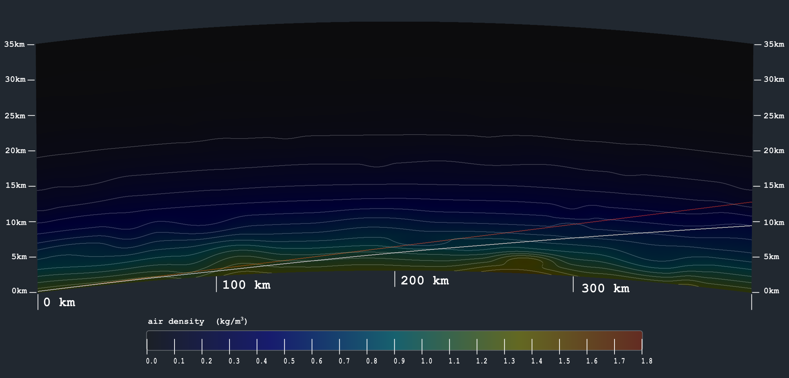

# Atmosphere Simulator

Simulating a turbulent globe atmosphere, and its refractive effects on long-range observations, to silence flat earthers.



Make sure you install the [dependencies](#dependencies) below, then after cloning the repo just type:
```
make
```

That should eventually produce a folder called `output` where you will find an MP4 file.

> [!NOTE]
> Currently the only way to configure the simulation parameters is by changing them in the source and recompiling.

# Build Stages

When you type `make`, these are the steps it takes:
1. Compiles the source (produces the `atmos_sim` executable file)
2. Runs the simulation (produces the PNG sequence in a folder called `frames`)
3. Encodes a video (produces the MP4 in a folder called `output`)

# Dependencies

Besides standard elements of a UNIX-style dev environment (like `cc` or `make`), you will need the following dependencies:
|Name|Package names on Ubuntu `apt` repo|Build stage|
|---|---|---|
|[SDL_Image](https://github.com/libsdl-org/SDL_image)|`libsdl2-image`, `libsdl2-image-dev`|Compiling|
|[FFmpeg](https://www.ffmpeg.org/)|`ffmpeg`|Encoding PNG sequence|

Single-command installation, if you're on Ubuntu:
```
sudo apt install libsdl2-image libsdl2-image-dev ffmpeg
```

> [!TIP]
> Notice that FFmpeg is not required for compiling or running the simulation. If you want to simply use the PNG sequence instead of encoding a video, then feel free to stop the build process after the simulation runs.
